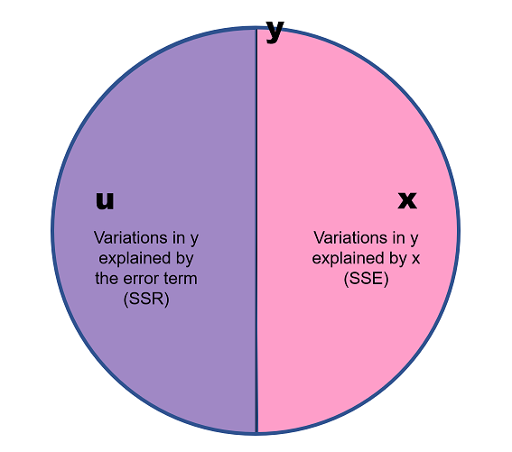

---
output:
  pdf_document: default
---
# Basics for Advanced Linear Regression Models: Part I

앞서 우리가 이 `Lv.2.Statistics`에서 다룰 내용들을 위한 기본적인 개념들---함수, 도함수(derivatives), 자료의 유형, 추론, 변수, 그리고 척도 등에 대한 내용들을 이론적으로, 경험적으로 살펴보았습니다. 

이제 여기에서는 `Lv.1.Statistics`에서도 다루었던 선형회귀모델에 대한 조금 더 깊이 들어간 내용들을 다루게 될 것입니다. 따라서 `Lv.1.Statistics`에서는 사실 예제를 통해서 훑고 지나갔단 선형회귀모델의 세부적인 구성요소들을 하나씩 짚어가면서 우리가 언제 선형회귀모델을 쓸 수 있고, 어떻게 해석할 수 있는지를 살펴볼 기초를 다져보겠습니다.

먼저, 간단한 함수적 관계를 나타내는 식이 있습니다. 이를 범죄의 모델(Model of Crime)이라고 해보겠습니다.
$$\text{범죄(Crime)} = f(\text{임금 수준(LW)})$$
위의 함수적 관계에서 각각의 항이 나타내는 것은 무엇일까요? 그리고 위의 관계는 우리에게 어떠한 것을 말해주고 있을까요? 위의 함수적 관계는 범죄(`Crime`)의 변화량(variation)을 설명하는 데 있어서 임금 수준(`LW`)이 중요하다는 것 밖에는 말해주지 않습니다. 이 모델을 가지고 우리는 그저 ``주로 임금 수준이 범죄를 설명하는 데 있어서 중요합니다''라고밖에 말할 수 없습니다. 어떻게, 얼마나 중요한지 위의 함수적 관계는 알려주지 않습니다. 다만 그 둘이 관계가 있다는 것만 시사합니다. 그렇다면 위의 함수적 관계를 조금 더 자세하게 풀어서 표현해보겠습니다.
$$\text{범죄(Crime)} = \beta_0 + \beta_1\text{임금 수준(LW)} + u$$
이제 우리에게 익숙한 선형모델의 형태로 나타납니다. 이 모델은 어떤 정보를 가지고 있을까요? 하나씩 뜯어보면, $\beta_0 + u$는 임금 수준이 0일 경우에 나타날 범죄율을 의미합니다. 그리고 임금 수준이 한 단위 증가할 때마다 범죄는 $\beta_1$만큼 증가하겠죠. 즉, 임금이 아예 없었을 경우의 범죄가 $\beta_0 + u$였다면, 임금이 한 단위 증가했을 때에는 $\beta_0 + \beta_1\times1 + u = \beta_0 + \beta_1 + u$가 되는 것입니다. 조금 더 자세히 뜯어보면,

  + 범죄(Crime): 종속변수(dependent variable)
  + 임금(LW): 설명변수(explanatory variable)[^3-1]
  + $\beta_0$: 임금이 0일 때의 범죄 수준
  + $\beta_1$: 임금이 한 단위 변화할 때 나타나는 범죄의 변화
  + $u$: 오차항(error term)

그렇다면 이 선형모델을 가지고 우리는 무엇을 할 수 있을까요? 바로 모델을 통해 우리가 관심을 가지고 있는 변수의 한 단위 변화와 연관되는 종속변수의 변화를 포착하는 것입니다. 한계효과(marginal effect)라고 하는데요, 단순선형회귀모델, 혹은 다중선형회귀모델에서는 각 변수들이 `+`로 결합되어 있습니다. 논리적으로 이 `+`는 서로가 독립적이라는 `OR`의 의미를 지니고 있습니다. 따라서 이와 같이 `+`로 변수들이 연결된 모델을 가산모형(additive models)이라고 하고, 이때의 한계효과는 각 변수들의 $\beta_i$라고 보시면 됩니다. 

주어진 모델에서 한계효과를 수리적으로 나타내면 다음과 같습니다. 
$$\text{Marginal effects:} \frac{\partial\text{(범죄)}}{\partial\text{(임금 수준)}} = \beta_1$$
그리고 이때 우리는 한계효과를 통해 특정한 임금 수준에서의 범죄 수준을 **예측**할 수 있게 됩니다. 
$$\text{Predictions:} \hat{\text{범죄}} = \beta_0 + \beta_1\hat{\text{임금 수준}}$$

자, 그럼 차근차근 하나씩 구체적인 의미들을 살펴보겠습니다.

## $\beta_1$에 대하여

다른 모든 조건들이 일정할 때(*Ceteris paribus*)라는 말이 있습니다. 통계방법에서는 다른 변수들의 효과를 실험실에서처럼 완벽하게 통제할 수 없기 때문에, 다른 변수들의 값을 동일하게 고정시켜둔 상태에서 우리가 관심을 가진 변수의 변화가 종속변수의 변화와 어떠한 관계에 놓여있는지를 살펴보게 됩니다. 따라서 $\beta_1$은 다른 모든 변수들이 동일한 값으로 고정되어 있을 때, 임금 수준의 값만 변화할 때 나타나는 범죄의 변화를 의미합니다.

그렇다면 $u$는 대체 무엇일까요? 이 모델에서 임금 수준과 $u$는 모두 확률변수입니다. 그리고 임금 수준이 변화하더라도 $u$는 변화하지 않습니다. $u$는 임금 수준으로 설명되지 않는 범죄의 나머지 부분으로, 우리가 관측하지 못하는(unobserved) 요소들입니다. 이론적으로는 `KKV`를 다시 한 번 불러와 그 개념대로 설명하면 이해가 쉽습니다. 우리는 종속변수, 범죄에 대해 체계적으로 연계되어 있을 것이라고 생각하고 체계적 요인(systematic factor)으로 임금 수준이라는 변수를 모델에 투입하였습니다. 그렇다면 우리의 이론적 기대가 다른 체계적 요인의 가능성을 제시하지 않는다면, 이론적으로는 범죄의 체계적 변화는 임금 수준으로 다 설명이 되고 체계적으로 설명되지 않는 비체계적 요인들만이 남게 될 것입니다. 이 비체계적 요인은 어떠한 경향성을 보이지 않는, 무작위(randamized)할 것이며 우리는 이를 확률변수(random variable)이라고 합니다. 마찬가지로 이 오차항---$u$는 설명변수와 `+`로 연결되어 있기 때문에 모델 안에서는 적어도 그들은 서로 관계가 없습니다(없어야만 합니다). 이를 수리적 공식으로 표현해보면 다음과도 같습니다.
$$E(u|x) = E(u)$$
주어진 $x$라는 조건에서 $u$의 기대값은 그냥 $u$의 기대값과도 같다, 즉 $x$는 $u$와 어떤 관계도 맺고 있지 않다는 것입니다. Wooldridge (2016: 22)는 "$\cdots$우리는 관측할 수 없는 $u$가 설명변수 $x$와 관계되지 않도록 제한하는 가정을 만들었을 때만, 데이터의 무작위 표본(random sample)로부터 신뢰할 수 있는(reliable) 추정치, $\beta_0, \beta_1$을 확보할 수 있다."고 언급하고 있습니다. 또한, "그러한 제한이 없이 우리는 다른 조건들이 일정할 때의 효과 $\beta_1$를 추정할 수 없다"고 서술하고 있습니다. 

여기서 하나 더 중요한 것이 바로 "무작위 표본"이라는 것입니다. 무작위화(randomization)은 우리가 설명변수들과 오차항 간의 독립성 가정을 수립할 수 있도록 해주는 핵심적인 개념입니다. 만약 어떤 표본이 무작위로 뽑힌 것이 아니라 어떠한 기준에 의해서 뽑혔다면, 우리는 그 표본으로부터 얻은 결과가 실로 모집단에서의 관계를 보여주는지, 혹은 표본 선정에 관여한 기준으로 인해 나타난 경향성인지를 구분할 수 없을 것입니다. 

$x$와 $u$에 대한 독립성 가정에 더해 Wooldridge (2016: 22)와 같이, 여기서도 $u$와 $x$가 어떻게 관계를 가지는지에 대한 가정을 별도로 수립하기 전까지는, 항상 $u$에 대하여 "모집단에서의 $u$의 평균값은 0이다"라는 가정을 수립하도록 합니다. 이 가정은 $E(u) = 0$이라고 표현할 수 있습니다.

### $E(u|x)$의 의미

$E(u|x)$에 다시 한 번 살펴보겠습니다. $E(u|x)$는 $x$라는 설명변수가 주어진 조건 하에서의 $u$, 오차항의 기대값을 보여주는 수리적 표현입니다. $u, x$가 확률변수이기 때문에, 우리는 $x$의 어떤 값이 주어졌다고 할 때의 $u$의 조건분포를 정의할 수 있습니다 (Wooldridge 2016: 22). 다른 표현으로는 $x$가 존재할 때의 $u$의 조건확률이라고 합니다. 단순선형회귀모델에서 우리는 이 조건확률을 0, $E(u|x)=0$이라고 가정합니다. 
이론적으로 다시 한 번 살펴보았다면, 이번에는 좀 더 실질적인 맥락에서 이 가정을 살펴보겠습니다. 설명변수에 대한 오차항의 조건확률이 0이라는 것은 현실 속에서는 성립(혹은 충족)되기 어렵습니다. 왜냐하면 현실 속에서는 우리가 관측가능한 종속변수에 영향을 미칠 '수도' 있는 여러 '관측 불가능한' 혹은 '우리가 생각하지 못한' 잠재적 요인들이 존재할 수 있기 때문입니다. 

또한, 우리가 모집단에 대한 회귀 함수(PRF)를 수립한다고 하더라도 우리가 확보 가능한 자료는 어디까지나 관측가능한 표본에 지나지 않습니다. 표본은 우리가 모집단에서 추출할 때마다 달라질 수 있고, 그것은 표본이 가지는 본연의 한계입니다. 따라서 어디까지나 표본을 사용한다는 점에서 우리는 본연적 불확실성에서 자유로울 수 없고, 이 오차항에 대한 가정은 충족되기 힘듭니다. 만약 이 오차항에 대한 가정이 심각하게 위배된다면, 우리는 그러한 표본으로부터 얻은 추정량들에 대해 "편향되었다"(biased)라고 할 수 있을 것입니다.

논리적으로 $\times$는 `AND`로 두 가지 사건이 동시에 발생하였다는 것을 의미합니다. 그러나 이미 우리는 앞서 $E(u)$라고 가정한 바 있습니다. 따라서 어떤 $x$의 값이 주어지던 간에 상관없이, $u$의 기대값은 0이 됩니다. 이는 $x$와 $u$가 서로 독립적인 사건으로 $u$가 $y$와 $x$와 공변하지 않는다는 것을 의미합니다. 

\begin{equation*}
\begin{aligned}
  Cov(x, u)& = E((x-\mu)(u-\nu)) = E(xu - x\nu - u\mu + \mu\nu)\\
  & = E(x\cdot u) - E(x\nu) - E(u\mu) + E(\mu\nu)\\
  & = E(x\cdot u) - \nu\mu - \mu\nu + \mu\nu\\
  & = E(x\cdot u) - \nu\mu\\
\end{aligned}
\end{equation*}

위의 수리적 유도에 따라 논리적으로 $E(u|x)=Cov(x,u)=E(x\cdot u)\neq 0$가 된다면, 설명변수는 종속변수에 영향을 미치는 오차항과 연관성이 있게 됩니다. 이 경우, 우리는 순수한 $x$와 $y$의 관계와 $y$에 대한 $u$의 관계를 구별해내기 어렵습니다. 이것이 $x$와 $u$가 서로 상관성이 있다고 할 때, 그 추정 결과가 편향된다고 말하는 근거입니다. 이렇게 여러 번 반복하는 이유는 그만큼 중요해서겠죠?

## 모집단 회귀 함수(Population Regression Function; PRF)

이전 자료에서 추론(inference) 파트에서 살펴보았듯, 우리가 관심있는 것은 표본에서의 변수들의 관계가 아닙니다. 우리는 어디까지나 그 표본이 모집단에 대해 대표성 있는 관측가능한 사례라고 간주하고, 그 표본에서의 관계가 관측불가능한 모집단에서도 유의미하게 나타날 것이라고 기대하는 것입니다. 따라서 어떠한 모델을 구성할 때, 우리는 두 가지 수준에서 모델을 생각해볼 수 있습니다. 바로 모집단 수준에서의 모델과 표본 수준에서의 모델입니다. PRF는 모집단 수준에서의 회귀모델을 의미합니다. 
\begin{equation*}
\begin{aligned}
E(\text{범죄}|x, u)&= \beta_0 + \beta_1\text{임금 수준} + E(u|x)\\
&=\beta_0 + \beta_1\text{임금 수준}\\
&=E(\text{범죄}|x)
\end{aligned}
\end{equation*}
문제는 우리는 관측할 수 없지만 분명 존재할 $\beta_0$와 $\beta_1$에 대해 알고자 한다는 것입니다. 따라서 우리는 가지고 있는 데이터로부터 모집단의 $\beta_0$와 $\beta_1$을 추론할 필요가 있습니다. 그리고 표본에서 이 모집단의 $\beta_0$와 $\beta_1$을 보여주는 통계치(statistics)이자 예측치(estimates)는 $\hat{\beta_0}$와 $\hat{\beta_1}$라고 할 수 있습니다. 하지만 데이터만 가지고 잇을 때에는 $\text{범죄}_i$와 $\text{임금 수준}_i$라는 각 변수들의 개별 관측치들은 가지고 있는 것이지만 아직 그 두 변수의 관계를 보여주는 $\beta_0$와 $\beta_1$의 표본통계치, $\hat{\beta_0}$와 $\hat{\beta_1}$는 알지 못합니다.

## 추정-조건들들로부터 도출

여기에서는 두 가지 가정들을 살펴봅니다. 이 $\beta_0$과 $\beta_1$을 얻기 위해서는 이 두 가정들이 충족되어야 합니다. 하지만 관측된 자료들을 이용하는 연구에서는 사실 이 가정들이 모두 완벽하게 충족되기란 어렵습니다. 따라서 우리는 확보할 수 있는 데이터셋에 관해 매우 조심스러운 접근을 취할 필요가 있습니다. 과연 내가 가진 데이터는 이 두 가정을 충족시키는지, 그리고 충족시키지 않는다면 어떻게, 얼마만큼 위배하고 있는지를 면밀히 살펴보아야 합니다.

### 가정1.과 제약1. 

제일 먼저 수립하는 가정과 그에 따른 제약은 바로 오차항의 기대값이 0으로 수렴한다는 것입니다. $E(u) = 0$으로 표현할 수 있겠죠? 그리고 오차항이 종속변수를 설명하기 위한 설명변수($x$)와 그 효과($\beta_1$), 그리고 설명변수가 0일 경우의 값($\beta_0$)이라는 것을 감안할 때, 위의 가정은 다음과 같이 표현할 수 있습니다.
\begin{equation*}
\begin{aligned}
E(u)&= 0\\
&= E(y-\beta_0-\beta_1x)
\end{aligned}
\end{equation*}
모집단 수준에서의 오차항에 대한 가정이 다음과 같고, 이것이 참이라고 한다면, 개별 관측치로 나타나는 표본에서의 오차항에 대한 대응---잔차(residuals)에도 그와 같은 가정을 적용할 수 있을 것입니다.
\begin{equation*}
\begin{aligned}
E(u_i)&= 0\\
&= E(y_i-\hat{\beta_0}-\hat{\beta_1}x_i)
&= \frac{1}{N}\sum^{N}_{i=1}(y_i-\hat{\beta_0}-\hat{\beta_1}x_i) = 0
\end{aligned}
\end{equation*}
모집단에서 우리는 기대값(expected values)이라는 표현을 사용할 수 있지만, 표본 수준에서는 관측가능한 값, 평균(mean)으로 이를 보여줄 수 있습니다.

### 가정2.와 제약2.

두 번째 가정이란 설명변수와 오차항 간의 공변(covariation)이 존재하지 않는다는 것입니다. 즉, $Cov(x, u)=0$이라는 것이죠. 이것이 의미하는 게 무엇일까요?

\begin{equation*}
\begin{aligned}
E(u|x)&= Cov(x, u) = E(x\cdot u)=0\\
&=E(x(y=\beta_0-\beta_1x))
\end{aligned}
\end{equation*}

모집단 수준에서 주어진 설명변수가 있을 때의 오차항의 기대값은 곧 둘 간의 상관성을 묻는 것과 같습니다. 그리고 논리적 기호로써 이는 $\times$이며, `AND`고 둘이 서로 동시에 작동한다는 것을 의미합니다. 그럼 표본 수준에서 살펴볼까요?

\begin{equation*}
\begin{aligned}
E(u|x)&= 0\\
&= E(x_i(y_i=\hat{\beta_0}-\hat{\beta_1}x_i))\\
&= \frac{1}{N}\sum^{N}_{i=1}(x_i(y_i=\hat{\beta_0}-\hat{\beta_1}x_i)) = 0
\end{aligned}
\end{equation*}

이제 위의 두 가정들로부터 선형회귀모델의 $\beta_0$과 $\beta_1$을 추정하기 위한 $\hat{\beta_0}$과 $\hat{\beta_1}$을 얻는 과정을 유도해보도록 하겠습니다.

#### 제1단계

가정 1($\frac{1}{N}\sum^{N}_{i=1}(y_i-\hat{\beta_0}-\hat{\beta_1}x_i)=0$)은 $\bar{y}=\hat{\beta_0}+\hat{\beta_1}\bar{x}$를 유도한다. 이때, $\bar{x}$와 $\bar{y}$는 각각 $x$와 $y$의 평균을 의미합니다.[^3-2] 즉, 선형회귀모델은 "종속변수와 설명변수의 평균을 지나는" 선을 그리게 됩니다. 위의 식에 따라 우리는 $\hat{\beta_0} = \bar{y}-\hat{\beta_1}\bar{x}$라는 결과를 얻을 수 있습니다.

#### 제2단계

가정 2는 표본에서의 설명변수와 오차항 간 공변이 없을, $\sum^{N}_{i=1}(x_i(y_i=\hat{\beta_0}-\hat{\beta_1}x_i)) = 0$를 의미합니다. 그리고 이 경우, 식을 풀어서 $\sum^{N}_{i=1}x_i(y_i-\bar{y})=\hat{\beta_1}\sum^{N}_{i=1}x_i(x_i-\bar{x})$로 표현할 수 있습니다. 여기서부터는 수리적으로 계속 유도해내는 거라서 굳이 하나하나 다 이해하실 필요가 있다고는 하지 않겠습니다만, 다시 쓰면$\cdots$
$\sum^{N}_{i=1}x_i(y_i-\bar{y})=\sum^{N}_{i=1}(x_i-\bar{x})(y_i-\bar{y})$로 보여줄 수 있고, $\sum^{N}_{i=1}x_i(_i-\bar{x})=\sum^{N}_{i=1}(x_i-\bar{x})^2$라고 할 수 있습니다. 결론적으로 이 일련의 복잡한 식들을 통해서 우리는 앞의 $\hat{\beta_0}, \hat{\beta_1}$에 대입, 이 두 통계치를 $x$와 $y$로 보여줄 수 있습니다.
\begin{equation*}
\begin{aligned}
&\hat{\beta_1}=\frac{\sum^{N}_{i=1}(x_i-\bar{x})(y_i-\bar{y})}{\sum^{N}_{i=1}(x_i-\bar{x})^2}\\
&\hat{\beta_0} = \bar{y}-\hat{\beta_1}\bar{x}
\end{aligned}
\end{equation*}

### 언제 $\beta_1$의 값이 커질까?

$\beta_1$은 간단히 얘기하면 기울기, $x$와 $y$ 간의 관계 양상을 보여주는 추정치입니다. 그런데 이 $\beta_1$을 추론하기 위하여 우리가 구하는 표본의 통계치, $\hat{\beta_1}$은 자료의 척도(scale)와 밀접하게 관련되어 있습니다. Wooldridge (2016: 26)에서 $\hat{\beta_1}$를 구하기 위한 공식을 $\hat{\beta_1} = \hat{\rho}_xy\cdot \frac{\hat{\sigma}_y}{\hat{\sigma}_x}$이라고 보여주고 있습니다. 이것이 의미하는 것은 무엇일까요? 만약 $y$의 척도, 단위가 $x$의 척도, 단위에 비해 훨씬 크다면, $\hat{\beta_1}$는 상대적으로 매우 커진다는 것을 의미합니다. 분수니까요. $x$의 분산이 $y$의 분산보다 훨씬 작을 경우에도 마찬가지로 상대적으로 큰 $\hat{\beta_1}$ 값을 가질 수 있다는 것을 보여줍니다.

## 추정-잔차의 최소화

위에는 $\beta_0, \beta_1$을 추정하기 위한 $\hat{\beta_0}, \hat{\beta_1}$을 구하기 위해 필요한 두 가지 가정을 살펴보았습니다. 이번에는 또 다른 관점에서 $\hat{\beta_0}, \hat{\beta_1}$을 살펴보겠습니다.

  + 예측값(fitted values): 주어진 설명변수 $x$를 우리가 구한 $\hat{\beta_0}, \hat{\beta_1}$에 대입하여 종속변수를 예측한 값입니다. $\hat{y_i} = \hat{\beta_0} + \hat{\beta_1}x_i + \hat{u}_i$라고 할 수 있습니다.
  
  + 잔차(Residuals, $\hat{u}_i$)는 모집단의 오차항 $u$와 대응되는 표본통계치입니다.
  
  + 잔차/오차항이란 우리가 예측하지 못한, 혹은 관측하지 못한 것---불확실성입니다. 불확실성을 가능한 한 줄이는 것은 어찌보면 사회과학의 본령일지도 모릅니다.
  
    + 잔차의 평균이 0이라고 했기 때문에 단순하게 이 잔차들을 더한 값을 최소화하는 것은 의미가 없습니다. 비체계적 요인들이 서로 상쇄(offsets)된다고 할 때, 잔차를 최소화하는 방법은 크게 두 가지가 있을 것입니다. 절대값을 구해서 그 모든 절대값들의 합이 최소가 되게 하는 것, 그리고 제곱의 합이 최소가 되게 하는 것입니다. 이 둘의 차이는 개념적으로는 없습니다. 다만 후자---제곱합이 수리적으로 더 계산이 용이하기 때문에 이 방법을 택하는 것일 뿐입니다.
    
  + 잔차의 제곱합을 최소화하는 것은 앞서 가정들에서 $\hat{\beta_0}, \hat{\beta_1}$을 도출해낸 것과 같은 결과로 이어집니다.
  
### 표본 회귀 함수 (Sample regression function, SRF)

표본 회귀 함수는 모집단의 모집단 회귀 함수와 동일한 형태를 가집니다($\hat{y}=\hat{\beta_0}+\hat{\beta_1}x$). 함수적 관계라는 측면에서는 $\hat{y} = f(x, \hat{\beta_1}, \hat{\beta_0})$라고도 표현할 수 있습니다. 우리는 이 표본 회귀 함수를 가지고 도함수(편미분) 등을 통해 우리가 원하는 결과들을 확인할 수 있습니다.

한 번 앞의 범죄-임금 수준 함수를 가지고 살펴보겠습니다. $y$가 범죄, $x$가 임금 수준이라고 하고 $\hat{\beta_0}=11, \hat{\beta_1}=-0.5$라고 해봅시다. 

  + 우리는 $x$가 20일때와 2일 때의 예측값의 차이도 살펴볼 수 있고; $f(x=20, \cdot) - f(x = 2, \cdot)$
  
  + 도함수를 통해서 한계효과를 계산할 수도 있으며; $\frac{\partial f(x, \cdot)}{\partial x}$
  
  + $x$가 0일 때의 $y$의 값을 구할 수도 있고; $f(x = 0, \cdot)$
  
  + 변화율을 살펴볼 수도 있습니다; $\frac{f(x=20, \cdot) - f(x = 2, \cdot)}{f(x = 2, \cdot)}\times100$
  
## 모집단 회귀 함수와 표본 회귀 함수의 이해

이쯤에서 한 번 내용들을 정리하고 넘어가겠습니다. $\beta_0, \beta_1, \hat{\beta_0}, \hat{\beta_1}, x, x_i, u, \hat{u_i}$, 그리고 $\bar{x}$와 같이 여러 가지 수리적 표현들이 등장했는데요, 이들 각각은 대체 무슨 의미를 지니고 있는 걸까요? 그리고 이 각각의 값들은 **확정적(fixed)**인걸까요 아니면 **확률적(random)**일까요? 이를 설명하기 위해서는 모집단과 표본의 관계에 대한 명확한 관점이 필요합니다.

우리는 모집단과 표본을 구별해야만 합니다. 그리고 모집단 회귀 모델과 표본 회귀 모델 역시 구분해야 합니다. 비록 우리가 모집단에 관심을 가지고 있다고 하더라도 현실 속에서 우리가 가질 수 있는 것은 오직 표본입니다. 따라서 우리는 관측불가능한 모집단의 특성들을 관측가능한 표본들을 통해서 추론하고자 합니다. 이는 이론적으로 모집단에 대해 우리가 관심을 가지는 값들---모수(parameters)는 이미 주어진 것들로 확정정인 값들이라는 것을 의미하며, 표본의 통계치들은 모집단에서 추출하는 과정 속에서 불확실성을 내재하게 되므로 표본에 따라 다르게 나타날 수 있습니다. 즉, 확률적입니다.
  
  + PRF는 모집단의 수준에서 어떠한 함수적 관계를 가지고 하나의 설명변수가 종속변수와 관계되어 있다고 가정할 때, 두 가지 모수를 구할 수 있다는 것을 보여줍니다. 바로 $\beta_0$와 $\beta_1$입니다.
  
    + $\beta_0$는 절편에 대한 모수값입니다. 우리가 상정한 설명변수의 값이 0일 때의 종속변수의 값을 보여주는 것이죠. 모집단의 속성을 보여주는 이 $\beta_0$은 모집단 수준에서는 확정적인 값입니다.
    
    + $\beta_1$은 기울기에 대한 모수값입니다. $\beta_1$은 다른 모든 조건들이 일정할 때, $x$와 $y$ 간의 관계를 보여줍니다. $\beta_0$와 마찬가지로 확정적인 값입니다.
    
    + $u$은 관측되지 않았지만 종속변수에 영향을 미칠 것으로 기대되는 요인들입니다. 따라서 $u$는 $x$에 의해 설명되지 않는 $y$의 일부라고 표현할 수 있습니다. 하지만 이 $u$는 비체계적이고 확률적이기 때문에 서로 상쇄되어 0으로 수렴할 것이라고 가정할 수 있습니다. 모집단의 수준에서는 확률변수이지만 동시에 이 오차항도 고정된 값입니다. 0으로 수렴하는 고정된 값이지요.
    
    + $x$는 종속변수를 설명할 것으로 기대되는 변수로 마찬가지로 모집단 수준에서는 확정적인 값을 가집니다. 종속변수 $y$도 마찬가지겠죠?
  
  + SRF는 표본 회귀 함수로 PRF와 같은 형태를 취하지만 다만 표본 수준의 논의라는 점이 다를 뿐입니다. 
  
    + $\hat{\beta_0}, \hat{\beta_1}$은 모수값, $\beta_0, \beta_1$을 추정하기 위해 구한 표본에서의 추정치입니다. $\hat{\beta_0}$은 절편에 대한 통계치이며 $\hat{\beta_1}$은 기울기에 대한 표본의 통계치입니다. 따라서 이 값들은 표본을 어떻게 뽑느냐에 따라서 매번 달라질 수 있으므로 "확률적"인 값들입니다.
    
    + $x_i, \hat{u_i}$은 각각 설명변수의 개별 관측값들과 주어진 설명변수 값에 대한 예측된 종속변수의 값과 실제 관측된 종속변수 값의 차이를 의미합니다. $u_i$는 $y_i - \hat{y}$라고 할 수 있습니다. 두 값 모두 표본 수준의 논의이므로 확률적인 값들입니다.
    
    + $\bar{x}$는 표본에서 관측된 설명변수의 평균으로 표본에 따라 달라집니다. $\bar{y}$도 마찬가지로 표본의 종속변수 평균이며 표본에 따라 달라지므로, 이 두 값 모두 확률적인 값들입니다.
    
### 일종의 "총합들" (sums)

우리는 다양한 종류의 제곱합들을 통해 회귀모델의 특성을 보여줄 수 있습니다.

  + 총 제곱합(Total sums of squares): SST = $\sum^{N}_{i=1}(y_i-\bar{y})^2$
  
  + 설명된 변동량의 제곱합(Explained sums of squares): SSE = $\sum^{N}_{i=1}(\hat{y_i}-\bar{y})^2$
  
  + 잔차의 제곱합(Residual sums of squares): SSR = $\sum^{N}_{i=1}(\hat{y_i}-y_i)^2$
  
  + 모델이 얼마나 잘 들어맞는지를 보여주는 측정지표인 결정계수, $R^2 \equiv  \frac{SSE}{SST}$ 

이같은 변동량에 대한 논의는 $y$, $x$, 그리고 $u$에 대한 벤다이어그램을 통해 도식적으로도 보여줄 수 있습니다. 물론 변수가 많아질수록 이렇게 도식화하는 것은 점점 어려워지기는 합니다. 그러나 여기서는 단순선형회귀모델을 가정하고 간단한 그림을 그려보겠습니다.
\newpage
```{r, fig.align='center', fig.pos="top", fig.height=4, fig.width=4}

```

벤다이어그램은 $y$, $x$, 그리고 $u$에 대한 단순선형회귀모델에서의 설명력을 묘사하고 있습니다. 먼저, 붉은 영역은 $x$를 가지고 설명되는 $y$의 변동량이라고 할 수 있습니다. 단순선형회귀모델에서 하나의 설명변수가 $y$를 설명할 것이라고 기대하더라도 우리는 그것이 $y$의 전체 변화를 설명할 수 있다고 단언할 수는 없습니다. Wooldridge의 표현대로라면 벤다이어그램에서 오른쪽이 "설명된 변동량의 제곱합"(Explained sum of squares, SSE)이며, 왼쪽이 잔차의 제곱합(Residual sum of squares, SSR)이라고 할 수 있습니다. 

### **R**로 계산해보기

앞에서의 이론적 논의들을 한 번 **R**을 통해 경험적 데이터를 가지고 계산해보도록 하겠습니다. 구체적으로는 주어진 데이터로 $\hat{\beta_0}, \hat{\beta_1}$, 그리고 $R^2$를 구해볼 겁니다. 

예제로 사용할 데이터는 2016년도 국가 수준의 집합자료들입니다. 사실 교차사례-시계열 자료로 구축할 수도 있지만 그렇게 되면 너무 복잡하니까 2016년도를 따로 떼어내서 교차사례 자료로 만들었습니다. 이 자료에서 국가의 노령화 정도와 경제 간의 관계에 관심을 가지고 있다고 하겠습니다.

분석단위는 따라서 국가가 되겠고, 노령화 수준이 높은 국가일수록 생산성이 낮아져서 경제 수준도 낮을 것이라는 이론적 기대를 가지고 모델을 만들어보겠습니다. 물론, 원래 모델을 구성하려면 더 세심한 고려가 필요하겠습니다만, 여기서는 **R** 예제를 보이는 것이 목표이니만큼 단순화된 모델 구축으로 넘어가겠습니다. 여하튼, 이 예제에서 상정된 이론적 모델은 다음과 같습니다: $\text{경제수준} = \beta_0 + \beta_1\text{(노령화 수준)} + u$.

분석을 위해 사용한 자료는 `The Quality of Government Basic Dataset` 입니다. 주요 변수로는 2016년도의 2010년 미국 달러 고정으로 계산된 1인당 GDP(`wdi_gdpcapcon2010`)와 노동가능인구 대비 노인 인구로 계산된 노령화 지수(`wdi_agedr`)입니다. 

  + 먼저, 1인당 GDP는 는 국내총생산을 그 해 중간의 인구 수로 나눈 값이기 때문에 단순 GDP 보다는 국가의 경제 규모를 더 잘 보여주는 지표라고 판단하여 사용하였습니다. 인구 100만명인데 100만 달러 버는 나라와 1000만명인데 300만 달러를 버는 나라를 비교해보았을 때, 후자가 더 부유하다고 단순하게 말하기는 어려울 겁니다.
  
  + 그 다음으로 생산성에 있어서 노령 인구가 젊은 인구에 비해서 더 낮을 것이라고 볼 수 있기 때문에 노령인구 수준이 더 높을수록 경제 수준이 더 낮을 것이라고 기대합니다. 따라서 노령인구 비율은 노동 가능인구에 대해 측정됩니다. 노동가능인구는 약 15세에서 64세 사이의 인구이며, 노령인구는 64세 초과의 인구입니다.
  
```{r}
library(ezpickr)
library(tidyverse)
QOG <- pick(file = "http://www.qogdata.pol.gu.se/data/qog_bas_ts_jan19.dta")
QOG_summary <- 
  QOG %>% select(ccodecow, cname, year, 
                 wdi_agedr, wdi_gdpcapcon2010) %>%
  dplyr::filter(year==2016) %>% drop_na()

y <- QOG_summary$wdi_gdpcapcon2010
x <- QOG_summary$wdi_agedr
model <- lm(y ~ x, data=QOG_summary)
b1.hat <- (sd(y) / sd(x)) * cor(y, x)
b0.hat <- mean(y) - b1.hat * mean(x)
y.hat <- b0.hat + b1.hat * x # 주어진 x로 예측한 y의 예측값들
SSE <- sum((y.hat - mean(y))^2)
SSR <- sum((y - y.hat)^2)
R2 <- SSE / (SSE + SSR) 
round(b1.hat, 3)
round(b0.hat, 3)
round(R2, 3)
```

각각의 결과들을 한 번 살펴보고 해석해볼까요? 편의상 소수점 없이 정수로만 나타내겠습니다.

  + 먼저 $\hat{\beta_1}$은 약 -418.258로 노령화 비율이 한 단위 증가할수록 $\hat{\beta_1}$만큼 1인당 GDP가 감소할 것이라는 것을 보여줍니다.
  
  + $\hat{\beta_0}$는 38207.65로 $x$, 노령화 비율이 0일 때의 1인당 GDP의 규모를 보여줍니다.
  
  + 그렇다면 모델의 설명력은? $R^2$로 볼 수 있습니다. 약 0.187이네요. 비율이니까 다시 말하면, 노령화 비율로는 1인당 GDP의 변화를 약 14.8\% 설명할 수 있다, 이렇게 이해하실 수 있을 것 같습니다. 한편, 이것은 단순하게 1인당 GDP의 평균으로 1인당 GDP의 변화를 설명하는 것보다 더 나은 설명력을 모델이 제공한다는 것을 의미합니다.
  
또, 척도에 따라 이 $\beta_1$의 값이 민감하게 변화한다는 것을 언급했었는데요. 이번에는 주어진 SRF, $\hat{y} = \hat{\beta_0} + \hat{\beta_1}x + \epsilon$에서 설명변수 $x$에 로그값을 취한 다른 측정척도의 $z$를 모델에 투입해보겠습니다. 

  + 앞서 1인당 GDP와 노령화 비율로 구성한 SRF에 따르면, $x$ 한 단위의 변화는 $\hat{\beta_1}$만큼의 종속변수 변화와 관계가 있습니다. 그리고 종속변수의 예측값은 $x=1$일 때, $\hat{y} = \hat{\beta_0 + \hat{\beta_1}}$로 나타낼 수 있습니다. 마찬가지로 $x=2$일 때는 $\hat{y} = \hat{\beta_0} + 2\hat{\beta_1}$로 보여줄 수 있고, $x=1$일 때와 $x=2$일 때의 차이가 $\hat{\beta_1}$입니다.
  
  + 그렇다면 만약 $z$를 투입하게 되면, $z$ 한 단위의 변화가 종속변수의 변화와는 어떤 관계를 맺게 될까요? 도식적으로 보면 다음과 같을 겁니다. $y = \hat{\beta_0} + \hat{\beta_1}\text{log}x$.
  
    + 이 경우에는, $y + \partial y = \hat{\beta_0} + \hat{\beta_1}\text{log}(x + \partial x)$라 할 수 있고,
    
    + 좀 더 자세하게는 아래와 같이 표현할 수 있습니다.

\begin{equation*}
\begin{aligned}
  \partial y&= \hat{\beta_1}(\text{log}(x + \partial x) - \text{log}x)\\
   &= \hat{\beta_1}\text{log}(1 + \frac{\partial x}{x})
\end{aligned}
\end{equation*}

만약 $\frac{\partial x}{x}$ is 작다면, t$\text{log}(1 + \frac{\partial x}{x}) \approx \frac{\partial x}{x}$일 거라고 생각해볼 수 있습니다.

여기서 우리는 $x$의 1퍼센트 변화가 $y$의 $\frac{\hat{\beta_1}}{100}$만큼의 변화와 관계가 있을 것이라고 이해할 수 있습니다. 즉, 변수의 측정척도는 연구에 있어서 중요합니다. 실질적으로 단순히 변화량을 보여주는 것만이 아니라 때로는 변화율을 보여주는 것이 실질적으로 더 많은 정보를 제공할 수 있습니다. 

$x$에 로그값을 취하면 우리는 $x$의 한 단위 변화가 아니라 1\% 변화가 $y$에 미치는 효과를 볼 수 있게 됩니다: $\frac{\hat{\beta_1}}{100}$. 예를 들어, $x$가 연간 소득이라고 할 때, 사실 우리는 연간 소득의 1달러 변화가 궁금하다기 보다는 연간 소득의 비율 변화가 $y$와 어떠한 관계가 있는지 궁금할 것입니다. 따라서 연구목적에 따라 우리는 측정척도들을 변화시킬 수 있으며, 주의해야할 것은 그 경우 변화된 척도에 맞춰 해석해줘야 한다는 것입니다.


[^3-1]: 저는 종속변수를 예측하기 위한 예측변수(predictor), 혹은 설명하기 위한 설명변수(explanatory variable)이라고 하고 독립변수(independent variable)라는 표현은 지양합니다. 왜냐하면 이 변수들이 외생적(exogeneous)이고 독립적이라는 근거는 어디에도 없기 때문입니다.
[^3-2]: $\bar{x}$와 $\bar{y}$는 주어진 표본에서의 특정한 "수", 평균입니다.